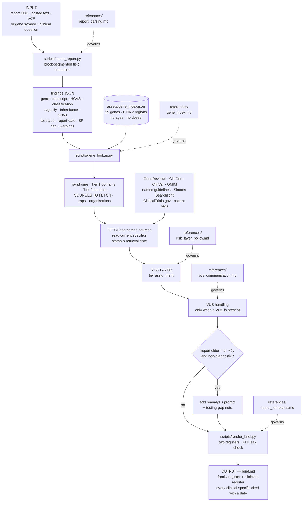

# Autism Gene-to-Care Navigator

An agent skill that turns a genetic test report for autism or another neurodevelopmental
condition into two things a person can actually use: a plain-language explanation, and
the **published, actionable care implications** of what was found.

---

## Why this exists

Around **11.3%** of people evaluated for autism or a neurodevelopmental disorder receive
guideline-concordant genetic testing ([Arcebido et al., *Autism*, 2025](https://journals.sagepub.com/doi/10.1177/13623613241289980),
7,539 EHRs). ACMG has recommended exome/genome sequencing as first- or second-tier since
2021. Nearly nine in ten eligible people never get it — and the barriers were insurance
status and race, not clinical need.

Among those who *do* get tested, the published care implications of the result routinely
never reach them. A child with a pathogenic `PTEN` variant needs thyroid surveillance
from childhood. A `SCN2A` variant's direction of effect changes which seizure medication
works — gain-of-function showed **94%** good-to-excellent phenytoin response,
loss-of-function **0%** ([*Brain*, 2024](https://academic.oup.com/brain/article/147/8/2761/7656659)).
Families are told about the developmental gene and hear nothing about either.

**The bottleneck is delivery, not method.** This skill is a delivery tool.

### What it is not

It is not a diagnostic classifier, and it does not ask *why* someone is autistic. Autistic
adults rank genetics research 23rd of 25 priorities and causation research dead last
([Cage et al., *Autism*, 2024](https://journals.sagepub.com/doi/10.1177/13623613231222656)).
The care implications handled here are **co-occurring medical conditions** — cancer risk,
epilepsy, cardiac issues — not autism itself. That line is deliberate and the skill
enforces it in its tone rules.

---

## The one rule that shapes everything

> **Never recite medical specifics from memory.**

Surveillance ages, screening intervals, imaging modalities, drug names and risk
percentages drift between guideline versions. A thyroid ultrasound starting at age 7
versus age 10 is the difference between useful and harmful — and a family *will* act on
a number the tool gives them.

So the curated index records **that** a protocol exists, **which** document holds it, and
**which domains** it covers. It deliberately contains no ages, no intervals, no doses.
The agent fetches the source and quotes it with a retrieval date. If it cannot reach the
source, it names the document and stops.

---

## Workflow


<details>
<summary>Mermaid source</summary>



</details>

### How the pieces interact

The **scripts form the data spine**; the **reference files govern judgement** at each
step. Scripts move and shape data. They never make a clinical call — that is what the
reference files instruct the agent to do, and why they are prose rather than code.

| Step | Script | Governed by | Produces |
|---|---|---|---|
| 1 · Ingest | `parse_report.py` | `report_parsing.md` | Findings JSON |
| 2 · Lookup | `gene_lookup.py` + `gene_index.json` | `gene_index.md` | Sources to fetch, tier-split domains, traps |
| 2b · Fetch | *(agent, via web)* | — | Current specifics + retrieval date |
| 3 · Risk layer | *(agent)* | `risk_layer_policy.md` | Tier assignment |
| 4 · VUS | *(agent)* | `vus_communication.md` | Uncertainty framing |
| 5 · Staleness | *(agent)* | `SKILL.md` | Reanalysis prompt |
| 6 · Render | `render_brief.py` | `output_templates.md` | `brief.md`, both registers |

---

## The risk layer

The most valuable and highest-risk part of the skill. One question governs it:

> **Is there a published protocol or guideline that defines an action?**


| | Tier 1 | Tier 2 | Tier 3 |
|---|---|---|---|
| **Test** | Published protocol with a defined action | Documented elevated risk, no protocol | Neither |
| **Action** | Include prominently | Include, framed as awareness | **Exclude entirely** |
| **Examples** | PTEN thyroid/renal · TSC renal/SEGA · NF1 optic glioma · 22q11.2 cardiac/immune/calcium | Phelan-McDermid regression/catatonia · 22q11.2 psychiatric risk | Polygenic scores · risk inferred from a VUS · trajectory predictions |
| **Framing** | "Standard care, not prediction" | "More common, not inevitable, treatable" | — |
| **Percentages** | Only if retrieved this session | Only if retrieved this session | Never |

Two gates sit in front of the tiering:

- **Secondary findings** (ACMG SF v3.3) → flag and route to genetic counselling. Never
  counsel directly; these carry whole-family implications.
- **Minors** → adult-onset information is withheld *unless there is action to take in
  childhood*. This is why PTEN and TSC surveillance still goes in: it starts in childhood.

A VUS bypasses the risk layer entirely. A VUS carries no risk information, must not drive
surveillance, and must not drive cascade testing.

---

## Repository layout

```
gene-to-care-navigator/
├── SKILL.md                          # trigger description, workflow, guardrails, tone
├── README.md
├── assets/
│   └── gene_index.json               # 25 genes + 6 CNV regions — routing only, no specifics
├── references/
│   ├── gene_index.md                 # curated gene notes, human-readable
│   ├── risk_layer_policy.md          # three tiers, ACMG SF v3.3, paediatric rule
│   ├── vus_communication.md          # why "uncertain" is not bad news
│   ├── report_parsing.md             # test types and their blind spots
│   └── output_templates.md           # family and clinician registers
├── scripts/
│   ├── parse_report.py               # report → findings JSON
│   ├── gene_lookup.py                # gene → sources, domains, traps
│   └── render_brief.py               # findings → two-register brief
└── docs/
    ├── workflow.mmd / .png
    └── risk_layer.mmd / .png
```

---

## Scripts

All three are dependency-free Python 3.10+ except PDF reading, which needs either
`pdfplumber` or `poppler-utils`.

### `parse_report.py`

Extracts structured findings from a report. Handles PDF, plain text, and VCF.

```bash
python scripts/parse_report.py report.pdf
python scripts/parse_report.py report.txt --json findings_raw.json
python scripts/parse_report.py --text "NM_001040142.2(SCN2A):c.5645G>A (p.Arg1882Gln), heterozygous, pathogenic"
```

**Design note — block segmentation.** The first version used a fixed-width context window
around each HGVS match and silently attributed the *previous* variant's classification and
zygosity to the next one. That failure mode is worse than missing the field, because the
output looks correct. The parser now segments the document into one block per variant
(bounded by neighbouring HGVS matches), reads gene and transcript *backwards* from the
variant, and classification, zygosity, inheritance and protein change *forwards*.

It is deliberately conservative: it emits `needs_review` flags rather than asserting a
guessed gene symbol, and `warnings` for a missing test type or report date.

<details>
<summary>Example output</summary>

```json
{
  "test_type": "exome",
  "report_date": "12 March 2026",
  "secondary_findings_mentioned": true,
  "variants": [
    {
      "gene": "PTEN", "transcript": "NM_000314.8",
      "hgvs_c": "c.697C>T", "hgvs_p": "p.Arg233Ter",
      "classification": "Pathogenic", "zygosity": "heterozygous",
      "inheritance": "de novo", "needs_review": []
    },
    {
      "gene": "CHD8", "transcript": "NM_001170629.2",
      "hgvs_c": "c.4837A>G", "hgvs_p": "p.Ile1613Val",
      "classification": "VUS", "zygosity": "heterozygous",
      "inheritance": "maternal", "needs_review": []
    }
  ]
}
```

</details>

### `gene_lookup.py`

Routes a gene or CNV region to its sources and care domains.

```bash
python scripts/gene_lookup.py PTEN
python scripts/gene_lookup.py TSC2                    # resolves alias → TSC1 entry
python scripts/gene_lookup.py SCN2A --json
python scripts/gene_lookup.py --cnv 22q11.2 --copies 1
python scripts/gene_lookup.py --list
```

Returns syndrome, Tier 1 and Tier 2 domains, **sources to fetch**, gene-specific traps,
and patient organisations. For an uncurated gene it returns a search order rather than
nothing — because *"there is no published surveillance protocol for this gene"* is a
useful answer families rarely get.

### `render_brief.py`

Assembles the two-register document from a structured findings JSON.

```bash
python scripts/render_brief.py findings.json --out brief.md
python scripts/render_brief.py findings.json --family-only
```

Empty sections omit themselves — an empty "Surveillance" heading reading "none
identified" is worse than no heading. A regex PHI check warns on MRN, DOB, NHS number,
SSN-shaped strings and lab accession numbers before anything is written.

---

## Guardrails

1. **No diagnosis, no prescription, no prognosis.** Assemble evidence; the clinical team decides.
2. **Every clinical specific carries a source and a retrieval date.**
3. **Never recite surveillance ages, intervals, or drug doses from memory.**
4. **A VUS is not actionable** — and the output says so explicitly.
5. **Secondary findings route to genetic counselling.** Never counselled directly.
6. **Abstain loudly when evidence is thin.** The FDA-cleared autism diagnostic aid Canvas Dx
   abstains on 37% of real-world cases ([*Scientific Reports*, 2025](https://www.nature.com/articles/s41598-025-15575-8)).
   Visible limits are why clinicians trust a tool.
7. **De-identify by default.**
8. **No unsourced risk numbers.** A remembered percentage is worse than none.

Showing the reasoning for every assertion is also what keeps this inside the 21st Century
Cures Act §3060 clinical-decision-support carve-out rather than in medical-device
territory — the clinician can independently review the basis for everything it says.

---

## Coverage

25 genes and 6 recurrent CNV regions, chosen because published care guidance genuinely
exists — not to look comprehensive.

**Tumour predisposition** — PTEN, TSC1/TSC2, NF1, DICER1
**Recurrent CNVs** — 22q11.2 del, 16p11.2 del/dup, 15q11-q13 dup, 22q13 del
**Channels / synaptic** — SCN2A, SCN1A, SCN8A, GRIN2A/2B, CACNA1C, STXBP1
**Chromatin / scaffold** — MECP2, SHANK3, SYNGAP1, CHD8, ADNP, ARID1B, ANKRD11, DYRK1A, KMT2A, POGZ, MED13L
**Other** — FMR1, UBE3A, NRXN1, PPP2R5D, SETD5, AUTS2

### Adding a gene

Add an entry to `assets/gene_index.json`, then a matching prose section in
`references/gene_index.md`:

```json
"GENE": {
  "syndrome": "…",
  "tier1_domains": ["…"],
  "tier2_domains": ["…"],
  "sources": [{"name": "…", "journal": "…", "year": 2025, "url": "…"}],
  "traps": ["…"],
  "organisations": [{"name": "…", "url": "…"}]
}
```

Aliases use `{"GENE2": {"same_as": "GENE1"}}`.

**Do not add ages, intervals, modalities, or doses.** If you find yourself wanting to,
the right move is a better `sources` entry.

---

## Testing

```bash
python scripts/gene_lookup.py --list          # index integrity
python scripts/parse_report.py --text "NM_000314.8(PTEN):c.697C>T (p.Arg233Ter), heterozygous, pathogenic, de novo"
```

v1 was validated against four synthetic de-identified reports: a two-variant exome
(pathogenic + VUS, block-structured), a 22q11.2 microarray, a negative 2021 microarray,
and an inline HGVS string. All four parse correctly; the PHI check fires on injected
identifiers.

**Not yet tested against real reports.** That is the next step and the most important one.

---

## Limitations

- **The gene index is a starting set**, not a reference database. Most NDD genes are not in it.
- **The parser is regex-based.** It handles common report layouts; it will not handle every
  lab's format. It flags rather than guesses, but check its output against the source.
- **No OCR.** Photographed reports need OCR first, then character-by-character verification
  of the variant string.
- **Direction of effect is not inferred.** For SCN2A, SCN8A, GRIN2A/2B the skill states
  that gain- versus loss-of-function is clinically decisive and routes it to genetics.
  It does not guess, because guessing wrong inverts the treatment.
- **Guideline currency depends on retrieval.** The index points at documents; if a
  guideline is superseded, the pointer needs updating.

---

## Evidence base

| Claim | Source |
|---|---|
| 11.31% guideline-concordant genetic testing rate | [Arcebido et al., *Autism*, 2025](https://journals.sagepub.com/doi/10.1177/13623613241289980) |
| Autistic community research priorities | [Cage et al., *Autism*, 2024](https://journals.sagepub.com/doi/10.1177/13623613231222656) |
| ES/GS as first- or second-tier testing | [Manickam et al., *Genetics in Medicine*, 2021](https://www.gimjournal.org/article/S1098-3600(21)05168-6/fulltext) |
| Secondary findings gene list | [ACMG SF v3.3, *Genetics in Medicine*, 2025](https://www.gimjournal.org/article/S1098-3600(25)00101-7/fulltext) |
| PTEN surveillance | [International PHTS Consensus, *Clin Cancer Res*, 2025](https://aacrjournals.org/clincancerres/article/31/9/1754/761247/Cancer-and-Overgrowth-Manifestations-of-PTEN) · [Pediatric update, *Clin Cancer Res*, 2025](https://aacrjournals.org/clincancerres/article/31/2/234/751094/Update-on-Pediatric-Surveillance-Recommendations) |
| 22q11.2 management | [AAP Health Supervision, *Pediatrics*, 2025;156(2)](https://publications.aap.org/pediatrics/article/156/2/e2025072717/202658/Health-Supervision-for-Children-With-22q11-2) · [Adult recommendations, *Genetics in Medicine*, 2023](https://www.gimjournal.org/article/S1098-3600(22)01028-0/fulltext) |
| SCN2A direction of effect → drug response | [*Brain*, 2024;147(8):2761](https://academic.oup.com/brain/article/147/8/2761/7656659) |
| Variant-class-dependent ASO therapy | [Kim-McManus et al., *Nature Medicine*, 2026](https://www.nature.com/articles/s41591-026-04527-y) |
| Blood RNA covers most ID/epilepsy panel genes | [De Cock et al., *npj Genomic Medicine*, 2025](https://www.nature.com/articles/s41525-025-00502-7) |
| Abstention as a trust feature | [Salomon et al., *Scientific Reports*, 2025](https://www.nature.com/articles/s41598-025-15575-8) |
| Gene discovery since 2021–22 (reanalysis rationale) | [Fu et al., *Nat Genet*, 2022](https://www.nature.com/articles/s41588-022-01104-0) · [Zhou et al., *Nat Genet*, 2022](https://www.nature.com/articles/s41588-022-01148-2) · [Trost et al., *Cell*, 2022](https://www.cell.com/cell/fulltext/S0092-8674(22)01324-1) |

---

## Roadmap

- **v1** *(current)* — report translation + gene-to-care + risk layer
- **v2** — Testing Gap Checker: what testing is guideline-indicated given a clinical
  picture, and the wording to bring to a clinician or insurer. Targets the 11.3% directly.
- **v3** — Reanalysis Advocate: which NDD genes were described since the report date, and
  a drafted request to the clinical service.
- **v4** — functional triage engine underneath: local SpliceAI/Pangolin, tissue-expression
  check for whether blood RNA-seq would be informative, AlphaFold structural context. This
  is infrastructure for "is this VUS actually actionable?", not a user-facing product.

---

## Licence

This repository is dual-licensed, because most of it is content rather than code.

| Path | Licence |
|---|---|
| `scripts/` | [Apache License 2.0](LICENSE) |
| `SKILL.md`, `README.md`, `references/`, `assets/gene_index.json`, `docs/` | [CC BY 4.0](LICENSE-DOCS) |

**Why the split.** The three Python files are small; the substance of this project is
curated prose and a curated dataset. Software licences apply awkwardly to both. CC BY 4.0
also expressly covers *sui generis* database rights (Section 4 of its legal code), which
matters for `gene_index.json` in the UK, EU, and other jurisdictions that treat database
rights separately from copyright — a permissive software licence alone would leave that
unclear. The index is meant to be reused and extended, so that gap is worth closing.

**If you modify the clinical content**, Apache 2.0 §4(b) requires you to state that files
were changed. Where those files are `references/risk_layer_policy.md` or
`references/vus_communication.md`, please make it prominent — they encode the guardrails,
and downstream users need to know they are not running the reviewed version.

**Third-party content.** This repository reproduces no text from clinical guidelines,
GeneReviews, or other copyrighted clinical sources. The gene index records factual
identifiers only — gene symbols, syndrome names, care-domain labels, citations, URLs — and
excludes screening ages, intervals, modalities, and doses by design. That exclusion exists
for clinical safety, and has the useful side effect of keeping the repository clear of
third-party copyright. Please preserve it: don't paste surveillance tables in.

See [`NOTICE`](NOTICE) for attribution requirements and the full disclaimer.

---

## Disclaimer

This software summarises published information. **It is not a medical device, does not
provide medical advice, and does not make diagnoses.** Output is intended to support
conversations with qualified clinicians, not replace them. Every clinical decision
belongs to the person's clinical team.

The warranty disclaimers and liability limitations in the Apache License 2.0 and CC BY 4.0
concern the software and content as such. They are not protection against harms arising
from clinical use, and should not be relied on as such. Anyone deploying this in or near a
clinical setting should obtain independent legal and regulatory advice.