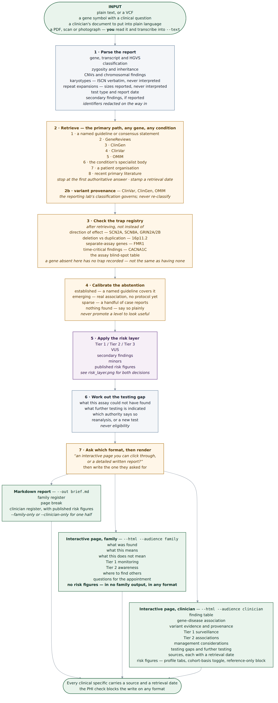
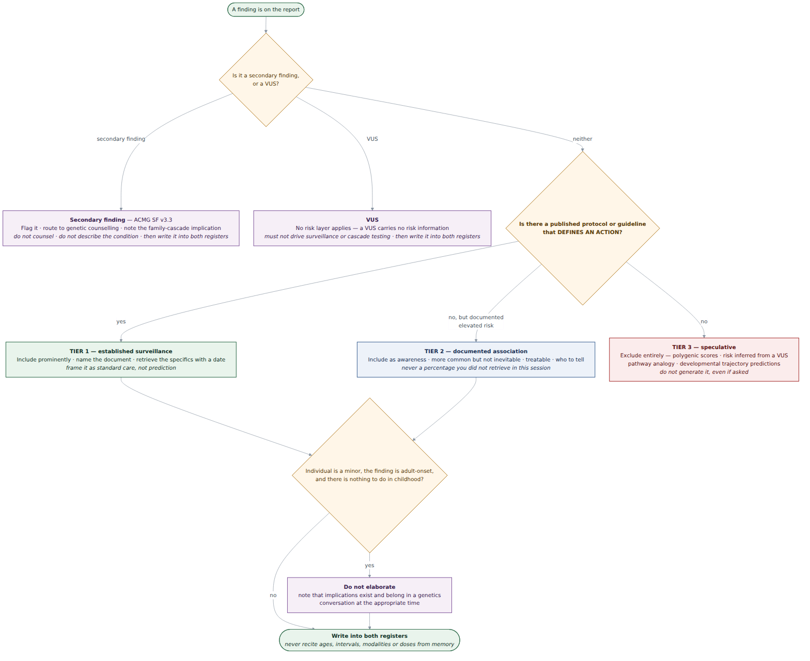

# Gene-to-Care Navigator

An agent skill that turns a genetic test report — for any inherited or genomic condition —
into two things a person can actually use: a plain-language explanation, and
the **published, actionable care implications** of what was found.

---

## Quick start

**1 · Get the skill.** Clone or download this repository, then build the upload folder:

```bash
python scripts/bundle_skill.py
```

That writes `dist/gene-to-care-navigator/` — **upload that folder**, not the repository.
The repository carries a test corpus, diagrams and git history that an uploaded skill does
not need; the bundle is about 300 KB against 5 MB. Add `--zip` if your platform wants an
archive. Nothing to install: there are no dependencies.

**2 · Just ask, in your own words.** Don't name the skill; it recognises what you're asking
about.

> *"We got our son's genetic results back and I don't understand any of it."*
> *"The microarray was normal. Does that rule out a genetic cause?"*
> *"Can you put this report into words I can give the parents?"*

**3 · Give it the report.** Attach the file or paste the text — a PDF, a photo of a letter,
or a few lines you typed out all work. The agent reads it directly.

**4 · You get two versions**: a plain-language one for the family, and a technical one for
clinicians. Ask for just one if that's all you need. You can also ask for an interactive
page instead of a written report.

Published risk percentages appear in the **clinician** version only, marked reference-only.
They are figures measured in study cohorts, not a forecast for one person, and reading them
against the cohort they came from is a clinician's job.

### Want to try it before using a real report?

`tests/fixtures/` holds invented reports and situations — no real patients — and
`tests/prompts.md` gives you something to paste alongside each one. Start with a report
from `tests/fixtures/reports/` and the question *"we got this back, can you tell me what
it means?"*

> **Before you use a real report**, read
> [Data privacy and confidentiality](#data-privacy-and-confidentiality). The skill removes
> names and record numbers, but the content still reaches whichever AI service you're
> using — that's a decision only you can make.

## Why this exists

Around **11.3%** of people evaluated for autism or a neurodevelopmental disorder receive
guideline-concordant genetic testing ([Arcebido et al., *Autism*, 2025](https://journals.sagepub.com/doi/10.1177/13623613241289980),
7,539 EHRs) — and the barriers were insurance status and race, not clinical need.

Among those who *do* get tested, the published care implications routinely never reach
them. A child with a pathogenic `PTEN` variant needs thyroid surveillance from childhood.
A `SCN2A` variant's direction of effect changes which seizure medication works —
gain-of-function showed **94%** good-to-excellent phenytoin response, loss-of-function
**0%** ([*Brain*, 2024](https://academic.oup.com/brain/article/147/8/2761/7656659)).
Families are told about the developmental gene and hear nothing about either.

This skill aims to help patients, their family, and healthcare professionals to understand, validate, and further research of a genetic conditions. Currently, it 
no longer limits to neurodevelopmental disorder, but **any** genetic report for analysis.

**This tool is addressing the delivery of information, not the methodology.**

### Scope

**Any inherited or genomic condition** — neurodevelopmental, cancer predisposition,
chromosomal syndromes such as Down syndrome, cardiac, metabolic, rare disease. Curation
started with neurodevelopmental conditions and the worked examples still skew that way,
but the *method* is disease-general: `references/retrieval_protocol.md` gives the search
order, the shape to extract into, and how to calibrate what you found. The curated indexes
are a **pitfall registry, not a coverage claim** — a gene's absence from them says nothing
about that gene.

### What it is not

It is *not* a diagnostic classifier, and it does *not* diagnose autism. *Please seek
professionals if you have any concerns.* Autistic adults rank genetics research 23rd of 25
priorities and causation research dead last ([Cage et al., *Autism*, 2024](https://journals.sagepub.com/doi/10.1177/13623613231222656)).
The care implications handled here are **co-occurring medical conditions** — cancer risk,
epilepsy, cardiac issues — not autism itself. The skill enforces that line in its tone rules.

---

## The one rule that shapes everything

> **Never recite medical specifics from memory.**

Surveillance ages, intervals, modalities and risk percentages drift between guideline
versions. A thyroid ultrasound starting at age 7 versus age 10 is the difference between
useful and harmful — and a family *will* act on a number the tool gives them.

Everything downstream follows from this. The indexes record **that** a protocol exists and
**which** document holds it, never the specifics; the agent fetches the source and quotes
it with a retrieval date; and if it cannot reach the source it names the document and
stops rather than filling the gap.

---

## Workflow



Mermaid source: [`docs/workflow.mmd`](docs/workflow.mmd)

The **scripts form the data spine**; the **reference files govern judgement**. Scripts
move and shape data — they never make a clinical call.

| Step | Script | Governed by | Produces |
|---|---|---|---|
| 1 · Ingest | `parse_report.py` | `report_parsing.md` | Findings JSON |
| 2 · Lookup | `gene_lookup.py` + `gene_index.json` | `gene_index.md` | Sources to fetch, tier-split domains, traps |
| 2a · Fetch | *(agent, via web)* | `retrieval_protocol.md` | Current specifics + retrieval date |
| 2b · Variant evidence | `gene_lookup.py --variant` | `retrieval_protocol.md` §2b | ClinVar / ClinGen / OMIM provenance for the lab's classification |
| 3 · Risk layer | *(agent)* | `risk_layer_policy.md` | Tier assignment |
| 4 · VUS | *(agent)* | `vus_communication.md` | Uncertainty framing |
| 5 · Staleness | *(agent)* | `SKILL.md` | Reanalysis prompt |
| 6 · Testing gap | `indication_lookup.py` + `indication_index.json` | `testing_indications.md` | Prior-assay blind spots, what is indicated, whose authority |
| 7 · Render | `render_brief.py` | `output_templates.md` | Both registers, as markdown or a self-contained page |

---

## The risk layer

The most valuable and highest-risk part of the skill. One question governs it:

> **Is there a published protocol or guideline that defines an action?**



| | Tier 1 | Tier 2 | Tier 3 |
|---|---|---|---|
| **Test** | Published protocol with a defined action | Documented elevated risk, no protocol | Neither |
| **Action** | Include prominently | Include, framed as awareness | **Exclude entirely** |
| **Examples** | PTEN thyroid/renal · TSC renal/SEGA · NF1 optic glioma · 22q11.2 cardiac/immune/calcium | Phelan-McDermid regression/catatonia · 22q11.2 psychiatric risk | Polygenic scores · risk inferred from a VUS · trajectory predictions |
| **Framing** | "Standard care, not prediction" | "More common, not inevitable, treatable" | — |
| **Percentages** | Only if retrieved this session, with the cohort named | Only if retrieved this session, with the cohort named | Never |

Two gates sit in front of the tiering:

- **Secondary findings** (ACMG SF v3.3) → flag and route to genetic counselling. Never
  counsel directly; these carry whole-family implications.
- **Minors** → adult-onset information is withheld *unless there is action to take in
  childhood*. This is why PTEN and TSC surveillance still goes in: it starts in childhood.

A VUS bypasses the risk layer entirely — it carries no risk information, must not drive
surveillance, and must not drive cascade testing.

**Published percentages are a clinician-register artefact.** They are read against the
cohort they were measured in, which is a professional's job; the same figure handed to a
family reads as a forecast. See [`render_brief.py`](#render_briefpy).

---

## Repository layout

```
gene-to-care-navigator/
├── SKILL.md                    # trigger description, workflow, guardrails, tone
├── LICENSE·LICENSE-DOCS·NOTICE # Apache 2.0 for code, CC BY 4.0 for content
├── assets/gene_index.json      # pitfall registry — traps, not coverage; no ages or doses
├── assets/indication_index.json # assay blind spots (universal) + example indications
├── references/                 # the judgement layer, as prose the agent reads
│                               #   (incl. data_privacy.md — read before a real report)
|
├── scripts/
│   ├── bundle_skill.py         # build + verify the upload folder (dev tool, not shipped)
│   ├── phi.py                  # identifier ruleset, shared by the scripts below
│   ├── parse_report.py         # report → findings JSON, identifiers redacted
│   ├── gene_lookup.py          # gene / syndrome / cytoband → sources, domains, traps
│   ├── indication_lookup.py    # features + prior tests → gaps, indications, authorities
│   └── render_brief.py         # findings → two-register brief
├── tests/                      # smoke_test.py · cases.md (rubric) · prompts.md
│   └── fixtures/               #   29 synthetic: 7 reports · 5 scenarios · 6 adversarial · 11 VCF
└── docs/                       # workflow + risk-layer diagrams (.png, .mmd)
```

---

## Requirements

**Python 3.10+ and nothing else.** No dependencies, no install step — the scripts use the
standard library only.

No HTTP client, no LLM SDK, no bioinformatics stack, no PDF extractor. The agent reads
documents and does retrieval through its own tooling; nothing here computes a clinical
answer. **A repository that cannot run a predictor cannot accidentally present one as a
finding** — and code that touches health information is easier to audit when there is
little to audit.

---

## Scripts

Design rationale for each behaviour lives in the code comments, next to the code it
explains. Run any script with `--help` for full usage.

### `parse_report.py`

Extracts structured findings from a report — plain text or VCF — covering sequence
variants, copy-number findings, and repeat expansions.

**There is no PDF reader, on purpose.** When a report is a PDF or a photograph the agent
reads it and passes the text in with `--text`; the extraction format is in
`references/report_parsing.md`. A bundled extractor adds a dependency and a crash surface,
and fails silently in the worst way — an image-only PDF yields empty text, which looks
exactly like a negative report.

```bash
python scripts/parse_report.py report.txt --json findings_raw.json
python scripts/parse_report.py annotated.vcf.txt --sample proband
python scripts/parse_report.py --text "NM_001040142.2(SCN2A):c.5645G>A (p.Arg1882Gln), heterozygous, pathogenic"
```

> **`.vcf` preferred, `.txt` as fallback.** Some platforms accept `.vcf` uploads; several
> refuse them. Format is detected from content — the `##fileformat` or `#CHROM` line — never
> from the extension, so `results.vcf` renamed to `results.vcf.txt` parses **identically**.
>
> The rename costs nothing. What a *conversion* does to the content is what costs, and the
> parser names which happened in `warnings`:
>
> | What reached the parser | Lost |
> |---|---|
> | `.vcf`, or a clean rename | nothing |
> | `##` headers stripped, SnpEff `ANN` | nothing material — ANN field order is fixed by spec |
> | `##` headers stripped, VEP `CSQ` | gene and HGVS — CSQ field order lived in that header |
> | `#CHROM` gone, data rows only | zygosity, hom-ref exclusion, sample identity, the VCF caveat |
> | Tabs turned to spaces by a paste | nothing, but a field containing a space could mis-split |
>
> Worked examples of all five are in `tests/fixtures/vcf_as_txt/`.

It is deliberately conservative, and most of its design is about *not* asserting things
the source did not say:

- Documents are segmented into one block per variant, so a neighbouring variant's
  classification cannot be attributed to this one.
- The report date is chosen by the label in front of it. The first date on a report is
  almost always the date of birth, and taking it inverts the staleness judgement.
- Prose CNVs ("a 2.6 Mb deletion at 22q11.21") are read as well as ISCN, but `copies`
  stays null and a region named only for contrast is not counted as a finding.
- Karyotypes are captured as the ISCN string verbatim and never interpreted — one
  character separates a trisomy from a translocation.
- Repeat expansions are extracted separately, with sizes reported and never interpreted.
  A limitations paragraph mentioning them does not become a result.
- **A VCF is not a report.** It carries no interpretation, and says so in `warnings`.
  Homozygous-reference rows are dropped — the sample does not carry those variants — a
  no-call is flagged as establishing nothing, and the sample whose genotypes were read is
  named, because a trio VCF is not reliably proband-first.

Anything uncertain surfaces as `needs_review` on the record or `warnings` on the report.
Identifiers are redacted before parsing begins — see
[Data privacy](#data-privacy-and-confidentiality).

### `gene_lookup.py`

Routes a gene, syndrome name, alias, or cytoband to its sources and care domains.

```bash
python scripts/gene_lookup.py PTEN
python scripts/gene_lookup.py "Cowden syndrome"       # alias → PTEN
python scripts/gene_lookup.py Rett                    # syndrome name → MECP2
python scripts/gene_lookup.py 22q11.2                 # cytoband → CNV region
python scripts/gene_lookup.py --cnv 22q11.2 --copies 1
python scripts/gene_lookup.py PTEN --variant "NM_000314.8:c.388C>T"
python scripts/gene_lookup.py --list
```

`--variant` adds the variant-level evidence step: it builds the ClinVar, ClinGen and OMIM
search URLs for that variant, states what to extract from each, and prints the traps. It
constructs **searches only** — never a Variation ID, MIM number or accession, because those
are exactly the identifiers that must not come from memory. One rule governs the step:
**the reporting laboratory's classification is the one that governs.** These sources give
its provenance — how many independent submitters, what review status, when last evaluated,
whether they conflict — not a different answer. A disagreement is reported and routed, not
settled here.

Returns syndrome, Tier 1 and Tier 2 domains, **sources to fetch**, traps, and patient
organisations. For an uncurated gene it returns a search order rather than nothing —
*"there is no published surveillance protocol for this gene"* is a useful answer families
rarely get. Lookups accept whichever word the person was given, since a family arrives
with "Rett" at least as often as with MECP2. CNV entries print band and copy number in
full, because deletion and duplication of one band can have partly opposite phenotypes.

### `bundle_skill.py`

Builds the upload folder and then checks it, rather than trusting the copy.

```bash
python scripts/bundle_skill.py            # -> dist/gene-to-care-navigator/
python scripts/bundle_skill.py --list     # what would be copied
python scripts/bundle_skill.py --zip      # also write the archive
```

It copies `SKILL.md`, `references/`, `scripts/`, `assets/` and the licence files, and
leaves out the test corpus, diagrams, README, git history and Python caches. Checks run
against the result: the frontmatter **parses as YAML** and sits inside the platform's name
and description limits, every path the bundled prose points at exists in the bundle, and
every script still runs with its assets resolvable from the new location. A failure is
printed with its reason and exits non-zero — the bundle is still written so you can look
at it.

The YAML check is not decoration. The `description` is an unquoted scalar, so a colon
followed by a space inside it (`care implications: surveillance…`) parses as a nested
mapping and the import fails with an error naming a column rather than a cause. Length
checks alone let exactly that ship once. `scripts/bundle_skill.py` holds the single
implementation and `tests/smoke_test.py` calls it, so the repository and a built bundle are
judged by the same rules.

The reference check is the one that earns the script. A reference file left out produces a
skill that reads normally and has silently lost a layer of judgement.

**`README.md` is deliberately not bundled.** It documents the repository — tests, fixtures,
roadmap, licence rationale — none of which exists in a bundle, so shipping it would put
dangling references in front of the agent. The privacy content the skill itself relies on
lives in `references/data_privacy.md`.

### `indication_lookup.py`

Routes a clinical picture to what further testing is indicated, and a test already done to
what it could not have found.

```bash
python scripts/indication_lookup.py --features "autism, developmental delay" --had microarray
python scripts/indication_lookup.py --list
```

It holds **no eligibility criteria, age thresholds or yield figures** — the same
discipline as the gene index. It records that an authority governs a picture and which
document it is; the criteria are retrieved and cited.

Matching is deliberately strict in both directions. An indication with two trigger groups
needs a hit in each, so "autism" alone cannot reach the *with developmental delay*
indication; and a negated feature does not count as present, so "no developmental delay"
is not read as evidence of delay. Both errors ran the same way — toward telling a family
they qualify. Where an indication matches partly on a feature not being *mentioned*, the
output says so, because absence of a phrase is not absence of the feature.

### `render_brief.py`

Assembles the two registers from a structured findings JSON — markdown, or a
self-contained HTML page with no scripts and no external assets, so it opens offline,
prints, and survives being emailed.

```bash
python scripts/render_brief.py findings.json --out brief.md
python scripts/render_brief.py findings.json --html brief.html --audience family
python scripts/render_brief.py findings.json --html clin.html --audience clinician
```

Empty sections omit themselves. The PHI check **refuses to write the file** if it finds an
identifier — writing is the step that makes a leak durable, so that is the step that stops
— with `--allow-phi` to override deliberately. It uses `scripts/phi.py`, the same ruleset
the parser redacts with, so the two cannot drift apart.

#### Published figures, and why there is no score

`risk_figures` reproduces penetrance figures that appear *in a source* — a bibliography
drawn to scale. Nothing is computed. **A figure describes a cohort; a score would describe
a person**, and that is a prediction rather than a citation.

Gates in front of every figure, all enforced in code:

| Gate | Effect |
|---|---|
| Reporting lab's classification | Pathogenic / likely pathogenic draw. VUS, benign, conflicting, or none recorded refuses the block and prints why |
| `condition`, `percent`, `cohort`, `source`, `retrieved` (YYYY-MM-DD) | All five, or the entry is not drawn and is listed with the reason |
| Percent outside 0–100 | Refused, not clamped — a typed 350 used to become a full-width bar with no warning |
| Audience | **Clinician register only.** No figure, caption or stylesheet reaches a family-facing output in any format |

The **cohort** field is mandatory because most published penetrance comes from families
ascertained *because someone was already affected*, which runs far higher than the figure
for a variant found incidentally. A bar without that line says something untrue.

The clinician surfaces carry a **reference-only** block: not a diagnosis, not a risk
assessment for this patient, not a basis for a clinical decision on its own, and a
direction to the genetics team or an appropriately qualified clinician. Polygenic scores
are excluded entirely (Tier 3).

#### The interactive panel

Pass `risk_panel` instead of the flat list and the clinician page gains profile tabs and a
cohort-basis toggle — radio inputs and CSS, still **no scripts**.

It looks like a variant browser, with two deliberate substitutions:

| A variant browser puts here | This puts |
|---|---|
| A calculated risk score | **Evidence provenance** — ClinVar review status, stars, submitter count, last evaluated. Retrieved, never derived |
| A penetrance or allele-frequency dial | **A cohort-basis toggle** — switches between the clinic-ascertained and population-based *published* figures for one condition |

The tabs change which finding you are reading; the toggle changes which citation you are
reading. A control that changes what a number *works out to* is a risk calculator on an
individual, whatever it is labelled, and there isn't one.

Putting the two cohorts one click apart is also the most useful thing the panel does: for
many genes the clinic-based and population-based penetrance differ enormously, and that
gap is the single largest caveat on any figure shown.

`surveillance_tier` accepts **1, 2 or 3 only** — the evidence tiers from the risk layer.
An actionability rating such as "Tier III (Low Risk)" is refused and dropped: whether a
finding is low risk is a clinical judgement this tool does not make. Each finding is gated
separately, and a refused finding **keeps its tab**, stating why it is empty.

---

## Guardrails

1. **No diagnosis, no prescription, no prognosis.** Assemble evidence; the clinical team decides.
2. **Every clinical specific carries a source and a retrieval date.**
3. **Never recite surveillance ages, intervals, or drug doses from memory.**
4. **A VUS is not actionable** — and the output says so explicitly.
5. **Secondary findings route to genetic counselling.** Never counselled directly.
6. **Abstain loudly when evidence is thin.** The FDA-cleared autism diagnostic aid Canvas Dx
   abstains on 37% of real-world cases ([*Scientific Reports*, 2025](https://www.nature.com/articles/s41598-025-15575-8)).
   Visible limits are why clinicians trust a tool.
7. **De-identify by default** — enforced in code, with limits worth knowing:
   see [Data privacy and confidentiality](#data-privacy-and-confidentiality).
8. **No unsourced risk numbers.** A remembered percentage is worse than none.
9. **No eligibility determination.** Whether testing is *recommended* is a clinical
   question with a published answer; whether *this person is eligible* is a policy question
   for their health system. Never "you qualify" or "this will be approved" — overstating
   access sets a family up for a refusal they were told would not come.
10. **Never invent a clinical feature to strengthen a request.** Only what the user
    reported goes into a drafted referral or funding request, and any draft is for a human
    to check and send.
11. **No risk scores.** A penetrance figure describes a cohort; a score describes a
    person. Figures are reproduced from a source with the cohort they were measured in,
    never computed, combined, averaged or personalised — and never attached to a VUS.
12. **Never re-classify a variant.** The reporting laboratory's classification governs.
    ClinVar and OMIM establish its provenance, not a replacement for it.

Showing the reasoning for every assertion is also what keeps this inside the 21st Century
Cures Act §3060 clinical-decision-support carve-out rather than in medical-device
territory — the clinician can independently review the basis for everything it says.

---

## Data privacy and confidentiality

A genetic test report is among the most sensitive documents a person will ever hold. It
concerns a named individual, it is frequently about a child, and it carries information
about relatives who never consented to anything. **The redaction in these scripts is a
safety net, not permission.**

This section is for whoever deploys the tool. The agent-facing version — what to do about
identifiers while producing a brief — is `references/data_privacy.md`, which ships with the
skill.

### What the code does

| Where | What it does |
|---|---|
| `phi.py` | The single identifier ruleset — name, DOB, record/hospital number, NHS number, SSN-shaped strings, lab accession, email — used by both scripts below, so they cannot drift apart. |
| `parse_report.py` | Redacts every rule above from the whole document *before* parsing. `--no-redact` opts out and is for synthetic reports. |
| `parse_report.py` | Drops dates labelled as birth or collection dates — wrong answers *and* identifiers. |
| `render_brief.py` | Scans the assembled document with the same ruleset and refuses to write the file if it finds any identifier. |
| `.gitignore` | Excludes `*.vcf`, `reports/`, `patient_data/`, `findings*.json`, `brief*.md`. |
| Everywhere | No network calls carry report content. The agent fetches *guideline sources*, never anything derived from the report. |

### What it cannot do

- **Regex redaction is pattern-matching, not comprehension.** It catches labelled
  identifiers. It misses a name in running prose ("Jack's results show…"), an unlabelled
  address, a referring clinician, an unusual date format, and anything mangled by OCR.
- **De-identification is not anonymisation.** A variant is itself identifying. Genomic
  data is re-identifiable in principle, and stripping every name and number does not make
  it anonymous. Under GDPR it remains special category data (Art. 9); under HIPAA, genetic
  information is PHI and is covered by GINA. Treat parser output as identifiable health
  data however clean it looks.
- **It says nothing about where the text goes.** Running this skill puts the report's
  content into the context of whatever model runs the agent, under that provider's terms
  rather than this repository's. **That is a disclosure, and it is your decision to make,
  not the tool's.**

### If you are handling other people's reports

- **Request for lawful consent when using real data**: patient consent or another
  Art. 6/Art. 9 basis under GDPR, a BAA under HIPAA, plus whatever your institution
  requires — DPIA, IG review, ethics approval. A clinician's duty of confidence applies
  here exactly as it does to any other disclosure.
- **Work from a de-identified copy** where one can be made. Redact before the file reaches
  the parser rather than relying on the parser to redact after.
- **A child's genetic data belongs to the child**, including the parts that will matter to
  them as an adult. A parent can consent today; that does not settle what should be
  written down, retained, or shared later.
- **Do not de-identify by removing only what you can see.** Family structure, a rare
  syndrome plus a location, or a distinctive variant can identify a person alone.
- **Delete intermediates.** `findings*.json` and `brief*.md` are gitignored but still on
  disk, and they contain everything.

If it is **your own report or your child's**, it is yours to share — leave the redaction
defaults on so identifiers don't reach a file you later hand to someone else. Everything
above about where the text goes still applies.

**Nothing here is legal advice.** If real patient data is involved and you are not certain
what applies, ask your DPO, IG lead, privacy officer, or IRB.

---

## Coverage

27 genes and 5 recurrent CNV regions, chosen because published care guidance genuinely
exists — not to look comprehensive.

- **Tumour predisposition** — PTEN, TSC1/TSC2, NF1, DICER1
- **Recurrent CNVs** — 22q11.2 del, 16p11.2 del/dup, 15q11-q13 dup, 22q13 del
- **Channels / synaptic** — SCN2A, SCN1A, SCN8A, GRIN2A/2B, CACNA1C, STXBP1
- **Chromatin / scaffold** — MECP2, SHANK3, SYNGAP1, CHD8, ADNP, ARID1B, ANKRD11, DYRK1A, KMT2A, POGZ, MED13L
- **Other** — FMR1, UBE3A, NRXN1, PPP2R5D, SETD5, AUTS2

For the testing-gap step, `assets/indication_index.json` carries 6 clinical indications,
7 prior-test blind-spot entries, and 4 governing authorities (ACMG 2021, the NHS National
Genomic Test Directory, ACMG SF v3.3, ACMG fragile X).

**Adding a gene:** add an entry to `assets/gene_index.json` (`syndrome`, `tier1_domains`,
`tier2_domains`, `sources`, `traps`, `organisations`; aliases use
`{"GENE2": {"same_as": "GENE1"}}`), then a matching prose section in
`references/gene_index.md`. **Do not add ages, intervals, modalities, or doses** — if you
want to, the right move is a better `sources` entry.

---

## Testing

```bash
python tests/smoke_test.py                    # parser regression + identifier leak scan
python scripts/gene_lookup.py --list          # index integrity
```

Testing splits into two layers, and only one can be automated.

**Parser layer** — `smoke_test.py` runs the 29-fixture corpus through `parse_report.py`
and asserts what came out. Expectations were recorded from verified runs rather than
written from intent, so a failure means behaviour changed — read the diff before editing
the expectation. It also cross-checks every planted identifier against *every* fixture's
output, and refuses to pass unless each fixture carries a synthetic marker.

**The corpus is small on purpose.** Seven reports and five scenarios, one per condition
category or case type — neurodevelopmental, chromosomal microdeletion, aneuploidy,
cardiac, metabolic, repeat expansion, and the negative result — plus the VCF and
conversion fixtures and six adversarial documents. Each earns its place by exercising
something no other fixture does; [`tests/cases.md`](tests/cases.md) records what.

**Figure and panel gates** — the same run asserts the refusals directly: a VUS, benign,
conflicting or missing classification refuses the block; a figure without a cohort, source
or `YYYY-MM-DD` date is not drawn; a percent outside 0–100 is refused rather than clamped;
figures never reach a family-facing page; an actionability rating in the tier slot is
dropped; and the panel emits no `<script>`.

**Skill layer** — [`tests/cases.md`](tests/cases.md) carries the rubric, scored by hand
because the failures that matter are judgement failures.
[`tests/prompts.md`](tests/prompts.md) carries what to paste: probing prompts, guardrail
pressure tests, multi-turn erosion sequences, and the must-not-fire set.

**No real patient report has been through this repository, and doing so is not a casual
step** — see [Data privacy](#data-privacy-and-confidentiality) first.

---

## Limitations

- **The gene index is a starting set**, not a reference database. Most NDD genes are not in it.
- **The parser is regex-based.** It flags rather than guesses, but check its output
  against the source; it will not handle every lab's format.
- **No OCR.** Photographed reports need OCR first, then character-by-character
  verification of the variant string. OCR also defeats identifier redaction.
- **Redaction is regex, and de-identified is not anonymous.**
  See [Data privacy](#data-privacy-and-confidentiality).
- **Direction of effect is not inferred.** For SCN2A, SCN8A, GRIN2A/2B the skill states
  that gain- versus loss-of-function is decisive and routes it to genetics. Guessing wrong
  inverts the treatment.
- **Guideline currency depends on retrieval.** If a guideline is superseded, the pointer
  needs updating.
- **Eligibility is never determined.** The testing-gap step reports what is *recommended*
  and names the authority; whether a given person qualifies is a policy question for their
  health system and clinical service, and the tool will not answer it.
- **The indication index is a starting set too**, and its access pathways cover the UK and
  US only. Elsewhere it gives the clinical recommendation and says plainly that it does not
  know the local route.
- **Feature matching is string-based.** It requires two independent features before
  claiming the with-developmental-delay indication and ignores negated mentions, but it
  reads text, not meaning — check what it matched on, which it prints.

---

## Citations

| Claim | Source |
|---|---|
| 11.31% guideline-concordant genetic testing rate | [Arcebido et al., *Autism*, 2025](https://journals.sagepub.com/doi/10.1177/13623613241289980) |
| Autistic community research priorities | [Cage et al., *Autism*, 2024](https://journals.sagepub.com/doi/10.1177/13623613231222656) |
| ES/GS as first- or second-tier testing | [Manickam et al., *Genetics in Medicine*, 2021](https://www.gimjournal.org/article/S1098-3600(21)05168-6/fulltext) |
| Secondary findings gene list | [ACMG SF v3.3, *Genetics in Medicine*, 2025](https://www.gimjournal.org/article/S1098-3600(25)00101-7/fulltext) |
| PTEN surveillance | [International PHTS Consensus, *Clin Cancer Res*, 2025](https://aacrjournals.org/clincancerres/article/31/9/1754/761247/Cancer-and-Overgrowth-Manifestations-of-PTEN) · [Pediatric update, *Clin Cancer Res*, 2025](https://aacrjournals.org/clincancerres/article/31/2/234/751094/Update-on-Pediatric-Surveillance-Recommendations) |
| 22q11.2 management | [AAP Health Supervision, *Pediatrics*, 2025;156(2)](https://publications.aap.org/pediatrics/article/156/2/e2025072717/202658/Health-Supervision-for-Children-With-22q11-2) · [Adult recommendations, *Genetics in Medicine*, 2023](https://www.gimjournal.org/article/S1098-3600(22)01028-0/fulltext) |
| SCN2A direction of effect → drug response | [*Brain*, 2024;147(8):2761](https://academic.oup.com/brain/article/147/8/2761/7656659) |
| Variant-class-dependent ASO therapy | [Kim-McManus et al., *Nature Medicine*, 2026](https://www.nature.com/articles/s41591-026-04527-y) |
| Blood RNA covers most ID/epilepsy panel genes | [De Cock et al., *npj Genomic Medicine*, 2025](https://www.nature.com/articles/s41525-025-00502-7) |
| Abstention as a trust feature | [Salomon et al., *Scientific Reports*, 2025](https://www.nature.com/articles/s41598-025-15575-8) |
| Gene discovery since 2021–22 (reanalysis rationale) | [Fu et al., *Nat Genet*, 2022](https://www.nature.com/articles/s41588-022-01104-0) · [Zhou et al., *Nat Genet*, 2022](https://www.nature.com/articles/s41588-022-01148-2) · [Trost et al., *Cell*, 2022](https://www.cell.com/cell/fulltext/S0092-8674(22)01324-1) |

---

## Roadmap

- **v1** — report translation + gene-to-care + risk layer
- **v2** — Testing gap: what the testing already done could not have found,
  what further testing is guideline-indicated and by whose authority, and the wording to
  bring to a clinician or payer. Delivered as sections of the clinician register rather
  than as a separate skill. Targets the 11.3% directly.
- **v3** — (i) Reanalysis advocate — case-level facts only (date, assay, coverage, singleton vs trio), with the assay-level judgement of whether there's anything to reanalyse at all. Names no newly described genes.(ii)Plain-language translation — technical document to family-readable, meaning preserved. Classifications never promoted, caveats rephrased never dropped, shared glossary with the register check.
- **v4** — Wrap-up: cost optimisation, latency reduction, overlap review. Broadened beyond
  neurodevelopmental conditions — the indexes became a *pitfall registry* and
  `retrieval_protocol.md` became the primary path, so an uncurated gene is the normal case
  rather than a miss. PDF extractor removed.
- **v5** *(current)* — Evidence and figures. (i) **Variant-level provenance**: a defined
  ClinVar / ClinGen / OMIM step answering *how well supported is this classification*,
  never *what should it be* — the reporting laboratory's call governs. (ii) **Penetrance,
  not a score**: published cohort figures with mandatory ascertainment, gated on the lab's
  classification, refused rather than clamped or guessed, and confined to the clinician
  register. (iii) An **interactive panel** whose controls switch between citations instead
  of computing a number. (iv) Fixture corpus cut to one case per condition category.

---

## Licence

Dual-licensed, because most of this repository is content rather than code.

| Path | Licence |
|---|---|
| `scripts/` | [Apache License 2.0](LICENSE) |
| `SKILL.md`, `README.md`, `references/`, `assets/gene_index.json`, `docs/` | [CC BY 4.0](LICENSE-DOCS) |

**Why the split.** The Python files are small; the substance here is curated prose and a
curated dataset. CC BY 4.0 expressly covers *sui generis* database rights (§4 of its legal
code), which matters for `gene_index.json` in jurisdictions that treat database rights
separately from copyright.

**If you modify the clinical content**, CC BY 4.0 §3(a)(1)(B) requires you to indicate
that you changed it. For `references/risk_layer_policy.md` and
`references/vus_communication.md`, make it prominent — they encode the guardrails, and
downstream users need to know they are not running the reviewed version.

**Third-party content.** No text from clinical guidelines, GeneReviews, or other
copyrighted sources is reproduced here. The gene index records factual identifiers only —
symbols, syndrome names, care-domain labels, citations, URLs — and excludes screening
ages, intervals, modalities and doses by design. That exclusion exists for clinical safety
and keeps the repository clear of third-party copyright. Please preserve it.

See [`NOTICE`](NOTICE) for attribution requirements and the full disclaimer.

---

## Disclaimer

This software summarises published information. **It is not a medical device, does not
provide medical advice, and does not make diagnoses.** Output is intended to support
conversations with qualified clinicians, not replace them. Every clinical decision belongs
to the person's clinical team.

The warranty disclaimers in Apache 2.0 and CC BY 4.0 concern the software and content as
such. They are not protection against harms arising from clinical use. Anyone deploying
this in or near a clinical setting should obtain independent legal and regulatory advice.
